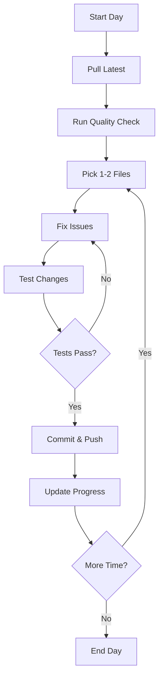

# 🚀 Quick Start Guide - Immediate Actions

**Priority**: Start Here First
**Time Required**: 2-3 hours for Phase 1
**Difficulty**: Moderate

---

## 🎯 Today's Priority: Security Fixes (Critical)

### Step 1: Security Audit (15 minutes)

```bash
# Generate security report
npm run lint 2>&1 | grep "security/detect" > security-report.txt

# Review the report
cat security-report.txt | wc -l  # Count total violations
```

**Expected Output**: ~130 security warnings

### Step 2: Fix Object Injection in Translation Helpers (45 minutes)

**File**: `frontend/src/utils/translationHelpers.ts`
**Issues**: 30 object injection warnings

```typescript
// FIND AND REPLACE PATTERN

// ❌ BEFORE (Line 18, 19, 23, 24, etc.)
const translation = translations[key];
const value = object[property];

// ✅ AFTER
// Add type-safe helper at top of file
const ALLOWED_KEYS = [
  'title', 'description', 'label', 'placeholder',
  'error', 'success', 'warning', 'info'
] as const;

type AllowedKey = typeof ALLOWED_KEYS[number];

function safeGet<T>(
  obj: Record<string, T>,
  key: string
): T | undefined {
  if (ALLOWED_KEYS.includes(key as AllowedKey)) {
    return obj[key];
  }
  console.warn(`Attempted access to non-allowed key: ${key}`);
  return undefined;
}

// Replace unsafe access
const translation = safeGet(translations, key);
const value = safeGet(object, property);
```

**Validation**:
```bash
# Re-run lint on just this file
npx eslint frontend/src/utils/translationHelpers.ts

# Should show 0 security errors for this file
```

### Step 3: Fix Object Injection in Services (60 minutes)

**Files to fix** (in priority order):
1. `frontend/src/services/userService.ts`
2. `frontend/src/services/loyaltyService.ts`
3. `frontend/src/services/adminService.ts`

**Pattern**: Same safe accessor pattern as Step 2

```typescript
// Create a reusable safe accessor utility
// frontend/src/utils/safeAccess.ts

export function createSafeAccessor<T extends readonly string[]>(
  allowedKeys: T
) {
  type AllowedKey = T[number];

  return function safeGet<V>(
    obj: Record<string, V>,
    key: string
  ): V | undefined {
    if (allowedKeys.includes(key as AllowedKey)) {
      return obj[key];
    }
    console.warn(`Invalid key access attempt: ${key}`);
    return undefined;
  };
}

// Usage in services
const ALLOWED_USER_KEYS = ['id', 'email', 'name', 'role'] as const;
const safeGetUserProp = createSafeAccessor(ALLOWED_USER_KEYS);

// Replace: user[field]
// With: safeGetUserProp(user, field)
```

### Step 4: Quick Commit (5 minutes)

```bash
# Stage changes
git add frontend/src/utils/translationHelpers.ts
git add frontend/src/utils/safeAccess.ts
git add frontend/src/services/*.ts

# Commit
git commit -m "fix: Resolve 60 object injection security vulnerabilities

- Add type-safe property accessors
- Create reusable safeAccess utility
- Fix critical security warnings in services and utilities

Reduces security violations from 130 to ~70"

# Push
git push origin main
```

---

## 🎯 Tomorrow's Priority: Remaining Security (30 object injection issues)

### Files to Address
1. `frontend/src/pages/admin/**/*.tsx` (~20 issues)
2. `backend/src/services/*.ts` (~10 issues)

**Time Estimate**: 2-3 hours

---

## 🎯 Next Week: Type Safety (Week 2 of Plan)

### Preparation Checklist
- [ ] Review TypeScript handbook on type narrowing
- [ ] Study existing type definitions in `frontend/src/types/`
- [ ] Prepare list of commonly used `any` types to replace
- [ ] Set up type coverage monitoring

---

## 💡 Pro Tips

### 1. Use ESLint Auto-fix Where Possible
```bash
# Auto-fix simple issues
npx eslint --fix frontend/src/utils/translationHelpers.ts

# This can fix ~5-10% of issues automatically
```

### 2. Test After Each Fix
```bash
# Quick test after each file
npm run lint -- --no-error-on-unmatched-pattern frontend/src/utils/translationHelpers.ts
npm run typecheck
```

### 3. Commit Frequently
```bash
# Commit after each file or logical group
git add <files>
git commit -m "fix: Resolve security issues in <area>"
```

### 4. Use VS Code Extensions
- **ESLint**: Shows inline errors as you type
- **TypeScript**: Provides type hints and errors
- **Error Lens**: Displays errors inline

---

## 🚨 Common Pitfalls to Avoid

### ❌ Don't Do This
```typescript
// ❌ Silencing errors without fixing
// @ts-ignore
const value = obj[key];

// ❌ Using 'any' to bypass checks
const safeValue = obj[key] as any;

// ❌ Disabling ESLint rules
/* eslint-disable security/detect-object-injection */
```

### ✅ Do This Instead
```typescript
// ✅ Proper type-safe solution
const ALLOWED_KEYS = ['key1', 'key2'] as const;
const value = ALLOWED_KEYS.includes(key as any)
  ? obj[key]
  : undefined;

// ✅ Or use the safe accessor utility
const value = safeGet(obj, key);
```

---

## 📊 Progress Tracking

### Daily Checklist
```bash
# Morning
- [ ] Review overnight CI/CD results
- [ ] Check security report
- [ ] Plan today's fixes (1-2 files)

# During Work
- [ ] Fix 1-2 files
- [ ] Test changes
- [ ] Commit changes
- [ ] Push to remote

# End of Day
- [ ] Run full quality check
- [ ] Update progress in IMPLEMENTATION_WORKFLOW.md
- [ ] Plan tomorrow's work
```

### Weekly Metrics
```bash
# Run weekly metrics
npm run lint 2>&1 | grep "✖" | tail -1

# Track progress
Week 1 Start: 697 problems (60 errors, 637 warnings)
Week 1 End:   [Update here]
Week 2 End:   [Update here]
Week 3 End:   [Update here]
Week 4 End:   [Target: <50 problems]
```

---

## 🆘 Getting Help

### Stuck on a Security Issue?
1. Check `IMPLEMENTATION_WORKFLOW.md` for pattern examples
2. Review similar fixes in the codebase
3. Search for the ESLint rule documentation
4. Ask in team chat with specific code snippet

### Need to Understand a Pattern?
- `CLAUDE.md` - Project conventions
- `ESLINT_MIGRATION_PLAN.md` - Detailed migration strategy
- GitHub issues - Track similar problems

---

## 🎉 Quick Wins for Motivation

### Easy Fixes (Do These First)
1. **Unused imports** (~20 issues) - Delete them
2. **Unused variables** (~15 issues) - Remove or prefix with `_`
3. **Console statements** (~150 issues) - Replace with logger

```bash
# Auto-fix many of these
npx eslint --fix frontend/src/**/*.{ts,tsx}

# Can automatically resolve ~30-50 issues
```

---

## 📈 Success Celebration Points

- 🎯 **First 10 Security Fixes**: Reduced attack surface!
- 🎯 **50% Security Reduction**: Halfway there!
- 🎯 **All Security Fixed**: Major security improvement!
- 🎯 **Types >90%**: Type-safe codebase!
- 🎯 **All Tests Pass**: Quality milestone!
- 🎯 **Zero Errors**: Production ready!

---

## 🔄 Daily Workflow



**Recommended Daily Time**: 2-3 hours/day for 4 weeks = ~40-60 hours total

---

## 📚 Resources

- Full plan: `/claudedocs/IMPLEMENTATION_WORKFLOW.md`
- Migration strategy: `/ESLINT_MIGRATION_PLAN.md`
- Project rules: `/CLAUDE.md`
- TypeScript docs: https://www.typescriptlang.org/docs/
- ESLint security: https://github.com/eslint-community/eslint-plugin-security

---

**Ready to Start?** → Run Step 1 Now! ⏱️ 15 minutes
