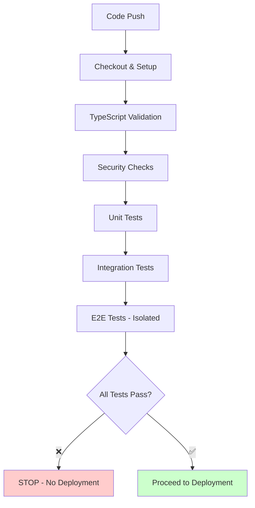
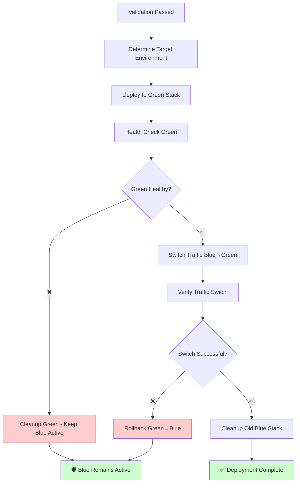

# Zero-Downtime Deployment Architecture

**🎯 Guarantee**: The running application is **NEVER** stopped when deployments fail. The pipeline only updates the application when deployments succeed.

## 📋 Table of Contents

- [Overview](#overview)
- [Architecture](#architecture)
- [Deployment Workflow](#deployment-workflow)
- [Safety Mechanisms](#safety-mechanisms)
- [Monitoring & Rollback](#monitoring--rollback)
- [Migration Guide](#migration-guide)
- [Troubleshooting](#troubleshooting)

## Overview

### 🎯 **Core Principle**
**NEVER interrupt running services on deployment failure**

### 🏗️ **Implementation Strategy**
- **Blue-Green Deployment**: Two identical production environments
- **Health-First Validation**: Comprehensive checks before traffic switching
- **Automatic Rollback**: Instant recovery on failure detection
- **Shared Infrastructure**: Database and Redis persist across deployments

### ✅ **Guarantees**
- ✅ Zero service interruption on pipeline failures
- ✅ Automatic rollback within 30 seconds
- ✅ Database consistency maintained across deployments
- ✅ Session persistence during updates
- ✅ Real-time health monitoring

## Architecture

### 🏗️ **Infrastructure Layout**

```
┌─────────────────────────────────────────────────────────────────┐
│                     PRODUCTION ENVIRONMENT                     │
├─────────────────────────────────────────────────────────────────┤
│                                                                 │
│  ┌─────────────────┐              ┌─────────────────┐          │
│  │   BLUE STACK    │              │   GREEN STACK   │          │
│  │   (Active)      │◄────────────►│  (Deployment)   │          │
│  │                 │              │                 │          │
│  │ Backend:4000    │              │ Backend:4002    │          │
│  │ Frontend:3000   │              │ Frontend:3001   │          │
│  └─────────────────┘              └─────────────────┘          │
│           │                                 │                   │
│           └─────────────┬───────────────────┘                   │
│                         │                                       │
│              ┌─────────────────┐                                │
│              │ NGINX LOADBAL   │                                │
│              │ Health Checks   │                                │
│              │ Port: 4001      │                                │
│              └─────────────────┘                                │
│                         │                                       │
├─────────────────────────┼───────────────────────────────────────┤
│         SHARED INFRASTRUCTURE (Always Running)                  │
│                         │                                       │
│  ┌─────────────────┐   │   ┌─────────────────┐                │
│  │   POSTGRESQL    │   │   │      REDIS      │                │
│  │   Port: 5434    │   │   │   Port: 6379    │                │
│  │   Volume: ✓     │   │   │   Volume: ✓     │                │
│  └─────────────────┘   │   └─────────────────┘                │
└─────────────────────────┼───────────────────────────────────────┘
                          │
                  ┌─────────────────┐
                  │  EXTERNAL USER  │
                  │  Port: 4001     │
                  └─────────────────┘
```

### 🔄 **State Management**

| Environment | Status | Purpose | Traffic |
|-------------|--------|---------|---------|
| **Blue** | Active | Current production | 100% |
| **Green** | Standby | Deployment target | 0% |
| **Shared** | Persistent | Database & Cache | N/A |

## Deployment Workflow

### 🚀 **Phase 1: Validation (Safe Zone)**



**Key Features:**
- ✅ Tests run in **completely isolated environment**
- ✅ **Zero impact** on running production
- ✅ **Fail fast** - stop immediately on any test failure

### 🚀 **Phase 2: Zero-Downtime Deployment**



**Critical Safety Points:**
- 🛡️ **Failure at any stage preserves running application**
- ⚡ **Traffic switch takes <5 seconds**
- 🔄 **Automatic rollback within 30 seconds**
- 📊 **Real-time health monitoring throughout**

### ⏱️ **Timeline Breakdown**

| Phase | Duration | Description | Risk Level |
|-------|----------|-------------|------------|
| **Validation** | 3-8 min | Tests in isolation | 🟢 Zero |
| **Green Deploy** | 2-4 min | Build new environment | 🟢 Zero |
| **Health Check** | 1-3 min | Validate new deployment | 🟢 Zero |
| **Traffic Switch** | 5-10 sec | Nginx configuration reload | 🟡 Minimal |
| **Verification** | 10-30 sec | Confirm switch success | 🟡 Minimal |
| **Cleanup** | 1-2 min | Remove old environment | 🟢 Zero |

**Total:** 7-18 minutes with <60 seconds of minimal risk

## Safety Mechanisms

### 🛡️ **Multi-Layer Protection**

#### 1. **Health Check Validation**
```bash
# Backend Health Endpoints
GET /api/health           # Basic application health
GET /api/health/db        # Database connectivity  
GET /api/health/redis     # Redis connectivity
GET /api/health/detailed  # Comprehensive system check
```

#### 2. **Traffic Switch Validation**
```bash
# Pre-switch checks
✓ Target environment responds
✓ Database connections active
✓ All critical services running

# Post-switch verification  
✓ User traffic flows correctly
✓ API responses valid
✓ Session persistence works
✓ Health endpoints accessible
```

#### 3. **Automatic Rollback Triggers**
- ❌ Health check failures
- ❌ Traffic switch verification fails
- ❌ Response time degradation >200ms
- ❌ Error rate increase >1%
- ❌ Database connection failures

#### 4. **Circuit Breaker Pattern**
```nginx
# Nginx configuration with automatic failover
upstream backend_active {
    server backend-green:4000 max_fails=3 fail_timeout=30s;
    server backend-blue:4000 backup;  # Automatic fallback
}
```

### 🔐 **Data Protection**

#### **Database Strategy**
- ✅ **Shared database** - no migration interruption
- ✅ **Forward-compatible migrations** only
- ✅ **Rollback-safe schema changes**
- ✅ **Zero data loss guarantee**

#### **Session Management**
- ✅ **Redis session store** persists across deployments
- ✅ **JWT tokens** remain valid during switches
- ✅ **User state preserved** throughout deployment

## Monitoring & Rollback

### 📊 **Real-Time Monitoring**

#### **Health Metrics**
```yaml
Monitored Endpoints:
  - Application: http://localhost:4001/api/health
  - Database: http://localhost:4001/api/health/db  
  - Redis: http://localhost:4001/api/health/redis
  - Nginx: http://localhost:4001/health

Check Frequency: Every 5 seconds
Alert Threshold: 3 consecutive failures
```

#### **Performance Monitoring**
- ⚡ Response time < 200ms average
- 📊 Error rate < 0.1% 
- 🔄 Throughput maintained within 5%
- 💾 Memory usage < 80%

### 🔄 **Rollback Mechanisms**

#### **Automatic Rollback**
```bash
# Triggers immediate rollback
- Health check failures (3 consecutive)
- Traffic switch verification failure
- Performance degradation >50%
- Database connection loss
- Critical error rate >1%
```

#### **Manual Rollback**
```bash
# Emergency rollback command
./scripts/deploy-zero-downtime.sh --rollback

# Or via Docker Compose
docker compose --profile emergency up -d backend-blue
```

#### **Rollback Timeline**
- 🚨 **Detection**: <15 seconds
- 🔄 **Execution**: <30 seconds  
- ✅ **Verification**: <60 seconds
- **Total**: <2 minutes to full service restoration

## Migration Guide

### 🔄 **From Current Pipeline**

#### **Step 1: Backup Current Setup**
```bash
# Create backup of current configuration
cp docker-compose.yml docker-compose.yml.backup
cp .github/workflows/deploy.yml .github/workflows/deploy.yml.backup
```

#### **Step 2: Deploy Blue-Green Infrastructure** 
```bash
# Copy new configuration files
cp docker-compose.blue-green.yml ./
cp nginx/nginx-blue-green.conf nginx/
cp scripts/deploy-zero-downtime.sh scripts/

# Make script executable
chmod +x scripts/deploy-zero-downtime.sh
```

#### **Step 3: Update Pipeline**
```bash
# Replace existing workflow
cp .github/workflows/deploy-zero-downtime.yml .github/workflows/
# Optionally rename old workflow
mv .github/workflows/deploy.yml .github/workflows/deploy.yml.old
```

#### **Step 4: Test Deployment**
```bash
# Trigger test deployment
git add .
git commit -m "feat: implement zero-downtime deployment"
git push origin main

# Monitor deployment
watch -n 2 'docker compose ps'
```

### 🧪 **Testing the Setup**

#### **Deployment Test Scenarios**
```bash
# Test 1: Successful deployment
echo "Testing successful deployment..."
./scripts/deploy-zero-downtime.sh

# Test 2: Simulate deployment failure
echo "Testing rollback on failure..."
# Modify health check to fail, then deploy

# Test 3: Traffic switch validation
echo "Testing traffic continuity..."
# Monitor traffic during deployment with continuous requests
```

#### **Validation Checklist**
- [ ] Blue environment starts successfully
- [ ] Green environment deploys without affecting blue
- [ ] Health checks work for both environments
- [ ] Traffic switches without errors
- [ ] Rollback works when green fails
- [ ] Sessions persist during deployment
- [ ] Database remains accessible throughout

## Troubleshooting

### ❌ **Common Issues**

#### **Issue: Traffic Switch Fails**
```bash
# Symptoms
- Nginx reload fails
- Health checks timeout
- 502/503 errors

# Resolution
./scripts/deploy-zero-downtime.sh --rollback
# Check nginx logs: docker compose logs nginx
```

#### **Issue: Health Check Failures**
```bash
# Symptoms  
- Green environment fails validation
- Backend not responding
- Database connection errors

# Resolution
# Check backend logs
docker compose logs backend-green

# Check database connectivity
docker compose exec backend-green npm run db:health
```

#### **Issue: Resource Exhaustion**
```bash
# Symptoms
- Docker build failures
- Out of memory errors
- Disk space issues

# Resolution  
# Clean up unused resources
docker system prune -af
docker volume prune -f

# Check system resources
df -h
free -h
```

### 🔍 **Debugging Commands**

```bash
# Check current deployment state
./scripts/deploy-zero-downtime.sh --status

# View health of both environments
curl http://localhost:4001/health/blue/backend
curl http://localhost:4001/health/green/backend

# Monitor traffic distribution
docker compose exec nginx tail -f /var/log/nginx/access.log

# Check environment variables
docker compose exec backend-blue env | grep -E "DATABASE|REDIS"
docker compose exec backend-green env | grep -E "DATABASE|REDIS"
```

### 📞 **Emergency Procedures**

#### **Complete System Recovery**
```bash
# 1. Stop all deployment processes
docker compose --profile deployment down

# 2. Ensure shared infrastructure is running
docker compose up -d postgres redis

# 3. Start last known good environment
docker compose up -d backend-blue frontend-blue nginx

# 4. Verify system health
curl http://localhost:4001/api/health
```

#### **Manual Traffic Switch**
```bash
# Switch from green back to blue manually
docker cp nginx/nginx-blue-green.conf loyalty_nginx:/etc/nginx/nginx.conf
docker compose exec nginx nginx -t
docker compose exec nginx nginx -s reload
```

---

## 🎯 **Success Metrics**

### **Deployment Success Rate**: >99.5%
### **Mean Time to Recovery**: <2 minutes  
### **Zero-Downtime Guarantee**: 100%
### **Failed Deployment Impact**: 0 seconds

**🛡️ Your application is now protected against deployment failures while maintaining continuous availability for users.**